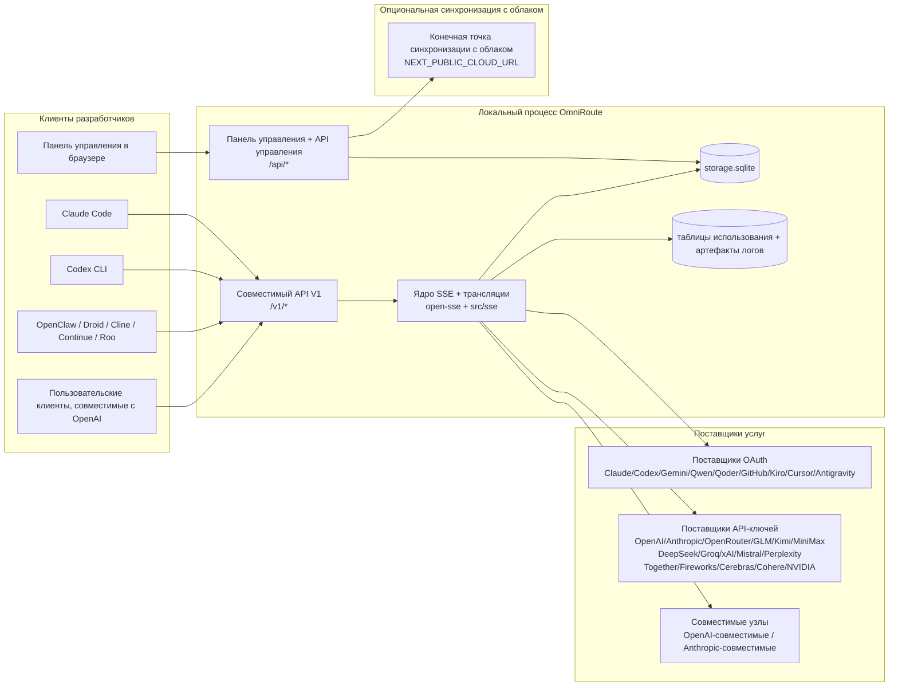
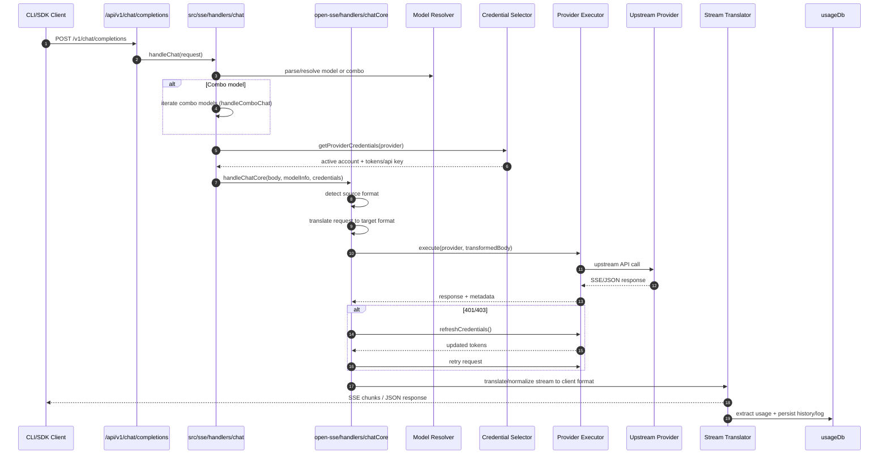
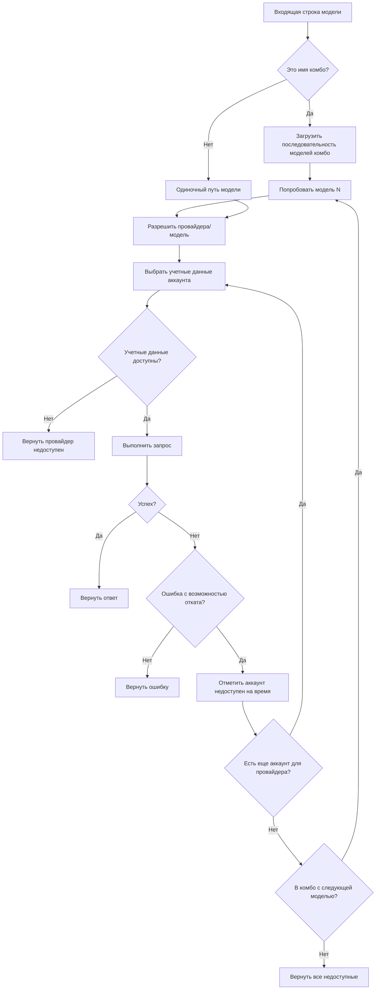
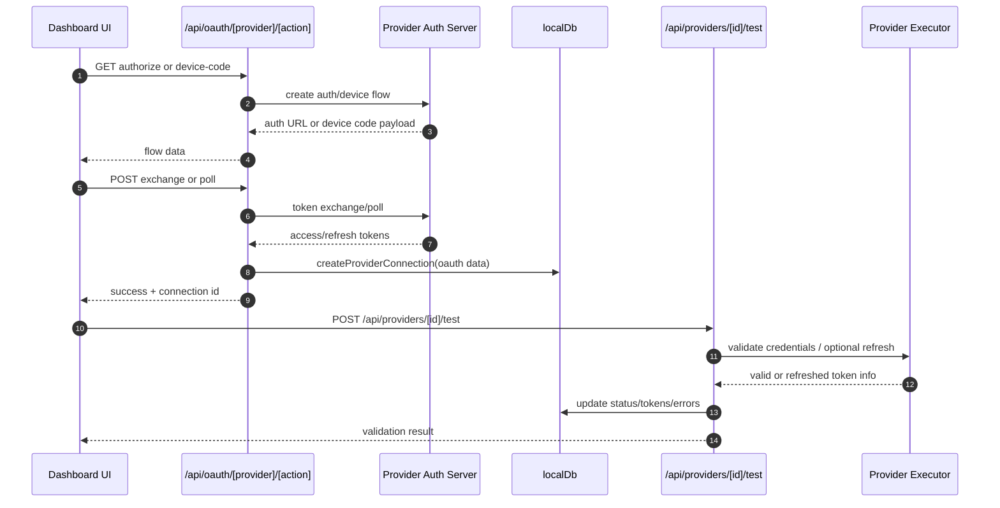
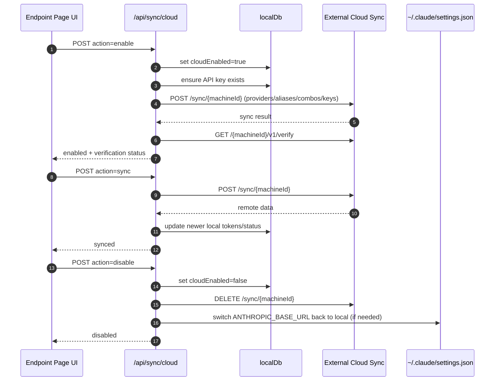
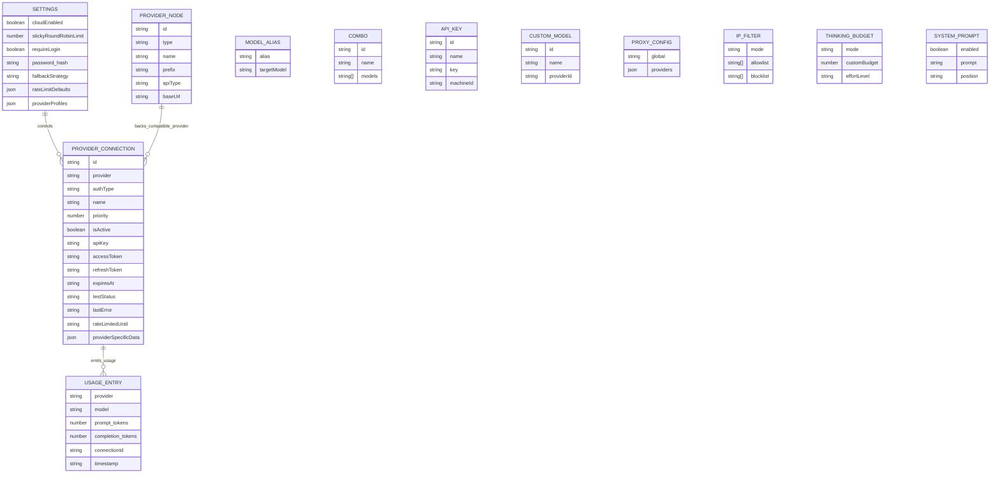
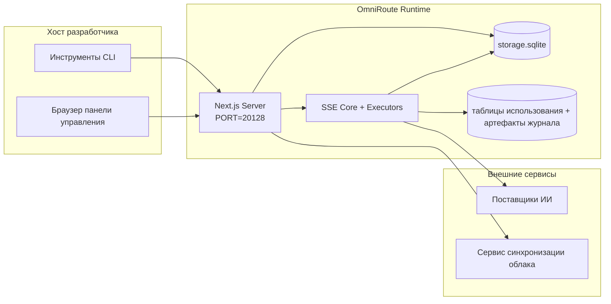

# ARCHITECTURE (Русский)

🌐 **Languages:** 🇺🇸 [English](../../../../architecture/ARCHITECTURE.md) · 🇸🇦 [ar](../../../ar/docs/architecture/ARCHITECTURE.md) · 🇦🇿 [az](../../../az/docs/architecture/ARCHITECTURE.md) · 🇧🇬 [bg](../../../bg/docs/architecture/ARCHITECTURE.md) · 🇧🇩 [bn](../../../bn/docs/architecture/ARCHITECTURE.md) · 🇨🇿 [cs](../../../cs/docs/architecture/ARCHITECTURE.md) · 🇩🇰 [da](../../../da/docs/architecture/ARCHITECTURE.md) · 🇩🇪 [de](../../../de/docs/architecture/ARCHITECTURE.md) · 🇪🇸 [es](../../../es/docs/architecture/ARCHITECTURE.md) · 🇮🇷 [fa](../../../fa/docs/architecture/ARCHITECTURE.md) · 🇫🇮 [fi](../../../fi/docs/architecture/ARCHITECTURE.md) · 🇫🇷 [fr](../../../fr/docs/architecture/ARCHITECTURE.md) · 🇮🇳 [gu](../../../gu/docs/architecture/ARCHITECTURE.md) · 🇮🇱 [he](../../../he/docs/architecture/ARCHITECTURE.md) · 🇮🇳 [hi](../../../hi/docs/architecture/ARCHITECTURE.md) · 🇭🇺 [hu](../../../hu/docs/architecture/ARCHITECTURE.md) · 🇮🇩 [id](../../../id/docs/architecture/ARCHITECTURE.md) · 🇮🇩 [in](../../../in/docs/architecture/ARCHITECTURE.md) · 🇮🇹 [it](../../../it/docs/architecture/ARCHITECTURE.md) · 🇯🇵 [ja](../../../ja/docs/architecture/ARCHITECTURE.md) · 🇰🇷 [ko](../../../ko/docs/architecture/ARCHITECTURE.md) · 🇮🇳 [mr](../../../mr/docs/architecture/ARCHITECTURE.md) · 🇲🇾 [ms](../../../ms/docs/architecture/ARCHITECTURE.md) · 🇳🇱 [nl](../../../nl/docs/architecture/ARCHITECTURE.md) · 🇳🇴 [no](../../../no/docs/architecture/ARCHITECTURE.md) · 🇵🇭 [phi](../../../phi/docs/architecture/ARCHITECTURE.md) · 🇵🇱 [pl](../../../pl/docs/architecture/ARCHITECTURE.md) · 🇵🇹 [pt](../../../pt/docs/architecture/ARCHITECTURE.md) · 🇧🇷 [pt-BR](../../../pt-BR/docs/architecture/ARCHITECTURE.md) · 🇷🇴 [ro](../../../ro/docs/architecture/ARCHITECTURE.md) · 🇸🇰 [sk](../../../sk/docs/architecture/ARCHITECTURE.md) · 🇸🇪 [sv](../../../sv/docs/architecture/ARCHITECTURE.md) · 🇰🇪 [sw](../../../sw/docs/architecture/ARCHITECTURE.md) · 🇮🇳 [ta](../../../ta/docs/architecture/ARCHITECTURE.md) · 🇮🇳 [te](../../../te/docs/architecture/ARCHITECTURE.md) · 🇹🇭 [th](../../../th/docs/architecture/ARCHITECTURE.md) · 🇹🇷 [tr](../../../tr/docs/architecture/ARCHITECTURE.md) · 🇺🇦 [uk-UA](../../../uk-UA/docs/architecture/ARCHITECTURE.md) · 🇵🇰 [ur](../../../ur/docs/architecture/ARCHITECTURE.md) · 🇻🇳 [vi](../../../vi/docs/architecture/ARCHITECTURE.md) · 🇨🇳 [zh-CN](../../../zh-CN/docs/architecture/ARCHITECTURE.md)

---

---

title: "Архитектура OmniRoute"
version: 3.8.2
lastUpdated: 2026-05-13
---

# Архитектура OmniRoute

🌐 **Языки:** 🇺🇸 [Английский](./ARCHITECTURE.md) | 🇧🇷 [Португальский (Бразилия)](../i18n/pt-BR/docs/architecture/ARCHITECTURE.md) | 🇪🇸 [Испанский](../i18n/es/docs/architecture/ARCHITECTURE.md) | 🇫🇷 [Французский](../i18n/fr/docs/architecture/ARCHITECTURE.md) | 🇮🇹 [Итальянский](../i18n/it/docs/architecture/ARCHITECTURE.md) | 🇷🇺 [Русский](../i18n/ru/docs/architecture/ARCHITECTURE.md) | 🇨🇳 [Китайский (упрощенный)](../i18n/zh-CN/docs/architecture/ARCHITECTURE.md) | 🇩🇪 [Немецкий](../i18n/de/docs/architecture/ARCHITECTURE.md) | 🇮🇳 [Хинди](../i18n/in/docs/architecture/ARCHITECTURE.md) | 🇹🇭 [Тайский](../i18n/th/docs/architecture/ARCHITECTURE.md) | 🇺🇦 [Украинский](../i18n/uk-UA/docs/architecture/ARCHITECTURE.md) | 🇸🇦 [Арабский](../i18n/ar/docs/architecture/ARCHITECTURE.md) | 🇯🇵 [Японский](../i18n/ja/docs/architecture/ARCHITECTURE.md) | 🇻🇳 [Вьетнамский](../i18n/vi/docs/architecture/ARCHITECTURE.md) | 🇧🇬 [Болгарский](../i18n/bg/docs/architecture/ARCHITECTURE.md) | 🇩🇰 [Датский](../i18n/da/docs/architecture/ARCHITECTURE.md) | 🇫🇮 [Финский](../i18n/fi/docs/architecture/ARCHITECTURE.md) | 🇮🇱 [Иврит](../i18n/he/docs/architecture/ARCHITECTURE.md) | 🇭🇺 [Венгерский](../i18n/hu/docs/architecture/ARCHITECTURE.md) | 🇮🇩 [Индонезийский](../i18n/id/docs/architecture/ARCHITECTURE.md) | 🇰🇷 [Корейский](../i18n/ko/docs/architecture/ARCHITECTURE.md) | 🇲🇾 [Малайский](../i18n/ms/docs/architecture/ARCHITECTURE.md) | 🇳🇱 [Голландский](../i18n/nl/docs/architecture/ARCHITECTURE.md) | 🇳🇴 [Норвежский](../i18n/no/docs/architecture/ARCHITECTURE.md) | 🇵🇹 [Португальский (Португалия)](../i18n/pt/docs/architecture/ARCHITECTURE.md) | 🇷🇴 [Румынский](../i18n/ro/docs/architecture/ARCHITECTURE.md) | 🇵🇱 [Польский](../i18n/pl/docs/architecture/ARCHITECTURE.md) | 🇸🇰 [Словацкий](../i18n/sk/docs/architecture/ARCHITECTURE.md) | 🇸🇪 [Шведский](../i18n/sv/docs/architecture/ARCHITECTURE.md) | 🇵🇭 [Филиппинский](../i18n/phi/docs/architecture/ARCHITECTURE.md) | 🇨🇿 [Чешский](../i18n/cs/docs/architecture/ARCHITECTURE.md)

_Последнее обновление: 2026-05-13_

## Краткое описание

OmniRoute — это локальный маршрутизатор и панель управления AI, построенный на Next.js.
Он предоставляет единую конечную точку OpenAI-совместимого API (`/v1/*`) и маршрутизирует трафик через несколько провайдеров с переводом, резервным копированием, обновлением токенов и отслеживанием использования.

Основные возможности:

- OpenAI-совместимый API-интерфейс для CLI/инструментов (177 провайдеров, 38 исполнителей)
- Перевод запросов/ответов между форматами провайдеров
- Резервное копирование моделей (последовательность нескольких моделей)
- Структурированные шаги комбо (`провайдер + модель + соединение`) с порядком выполнения по `compositeTiers`
- Резервное копирование на уровне учетной записи (несколько учетных записей на провайдера)
- Предварительная проверка квоты и выбор учетной записи P2C с учетом квоты в основном чате
- Управление соединениями провайдеров через OAuth + API-ключи (14 модулей OAuth)
- Генерация эмбеддингов через `/v1/embeddings` (6 провайдеров, 9 моделей)
- Генерация изображений через `/v1/images/generations` (10+ провайдеров, 20+ моделей)
- Транскрипция аудио через `/v1/audio/transcriptions` (7 провайдеров)
- Текст в речь через `/v1/audio/speech` (10 провайдеров)
- Генерация видео через `/v1/videos/generations` (ComfyUI + SD WebUI)
- Генерация музыки через `/v1/music/generations` (ComfyUI)
- Веб-поиск через `/v1/search` (5 провайдеров)
- Модерация через `/v1/moderations`
- Ранжирование через `/v1/rerank`
- Разбор тегов think (``) для моделей рассуждений
- Санитизация ответов для строгой совместимости с OpenAI SDK
- Нормализация ролей (developer→system, system→user) для кросс-провайдерной совместимости
- Преобразование структурированных выходных данных (json_schema → responseSchema Gemini)
- Локальное сохранение провайдеров, ключей, псевдонимов, комбо, настроек, ценообразования (26 модулей БД)
- Отслеживание использования/стоимости и логирование запросов
- Необязательная синхронизация с облаком для синхронизации состояния между устройствами
- Белый/черный список IP для контроля доступа к API
- Управление бюджетом мышления (passthrough/auto/custom/adaptive)
- Внедрение глобального системного приглашения
- Отслеживание сессий и отпечатков
- Улучшенное ограничение скорости с учетом профилей провайдеров
- Шаблон цепного разрыва для устойчивости провайдера
- Защита от массового запроса с использованием мьютекс-блокировки
- Кэш дедупликации запросов на основе подписи
- Уровень домена: правила стоимости, политика резервного копирования, политика блокировки
- Context Relay: резюме передачи сессии для непрерывности при смене учетной записи
- Сохранение состояния домена (кеш SQLite для резервного копирования, бюджетов, блокировок, цепных разрывов)
- Движок политик для централизованной оценки запросов (блокировка → бюджет → резервное копирование)
- Телеметрия запросов с агрегацией задержек p50/p95/p99
- Телеметрия целевых комбо и историческая оценка здоровья целевых комбо через `combo_execution_key` / `combo_step_id`
- Идентификатор корреляции (X-Request-Id) для трассировки от начала до конца
- Журнал аудита соответствия с возможностью отказа для каждого API-ключа
- Фреймворк оценки для обеспечения качества LLM
- Панель состояния здоровья с реальным временем статуса цепных разрывов провайдера
- MCP Server (37 инструментов) с 3 транспортами (stdio/SSE/Streamable HTTP)
- A2A Server (JSON-RPC 2.0 + SSE) со навыками и жизненным циклом задач
- Система памяти (извлечение, внедрение, извлечение, суммирование)
- Система навыков (реестр, исполнитель, песочница, встроенные навыки)
- Прокси MITM с управлением сертификатами и обработкой DNS
- Промежуточное ПО для защиты от инъекций приглашений
- Конвейер сжатия приглашений с Caveman, RTK, стопками конвейеров, комбо сжатия, языковыми пакетами и аналитикой
- Реестр ACP (Agent Communication Protocol)
- Модульные провайдеры OAuth (14 отдельных модулей под `src/lib/oauth/providers/`)
- Скрипты деинсталляции/полной деинсталляции
- Действие восстановления среды OAuth
- Мост WebSocket для OpenAI-совместимых клиентов WS (`/v1/ws`)
- Управление синхронизационными токенами (выпуск/отзыв, загрузка пакета конфигурации с версией ETag)
- GLM Thinking (`glmt`) как предустановка провайдера первого класса
- Гибридное подсчет токенов (подсчет токенов на стороне провайдера `/messages/count_tokens` с резервным копированием оценки)
- Автоматическое заполнение псевдонимов моделей (30+ нормализаций кросс-прокси-диалектов при запуске)
- Безопасный исходящий fetch с защитой SSRF, блокировкой частных URL и настраиваемым повторением
- Повторные попытки чата с учетом охлаждения с настраиваемыми `requestRetry` и `maxRetryIntervalSec`
- Проверка среды выполнения с Zod при запуске
- Аудит соответствия v2 с пагинацией, событиями CRUD провайдера и логированием блокировки SSRF

Основная модель выполнения:

- Маршруты приложения Next.js под `src/app/api/*` реализуют как API панели управления, так и совместимые API
- Общая SSE/маршрутизация ядра в `src/sse/*` + `open-sse/*` обрабатывает выполнение провайдера, перевод, потоковую передачу, резервное копирование и использование

## Справочные диаграммы

Канонические, версионно-контролируемые источники Mermaid для платформы v3.8.0 находятся в
[`docs/diagrams/`](../diagrams/README.md). Два из них воспроизведены ниже для ориентации;
остальные приведены в соответствующих руководствах по предметной области.


> Источник: [diagrams/request-pipeline.mmd](../diagrams/request-pipeline.mmd)


> Источник: [diagrams/resilience-3layers.mmd](../diagrams/resilience-3layers.mmd) — также приведено в
> [RESILIENCE_GUIDE.md](./RESILIENCE_GUIDE.md) и в справочнике по устойчивости `CLAUDE.md`.

## Область применения и границы

### Включено

- Локальный шлюз и время выполнения
- API управления дашбордом
- Аутентификация провайдера и обновление токена
- Перевод запросов и потоковое передача SSE
- Локальное состояние и сохранение использования
- (Опциональная) оркестрация синхронизации с облаком

### Исключено

- Реализация облачной службы за `NEXT_PUBLIC_CLOUD_URL`
- SLA провайдера/контрольная панель вне локального процесса
- Внешние двоичные файлы CLI (Claude CLI, Codex CLI и т.д.)

## Поверхность дашборда (текущая)

Основные страницы под `src/app/(dashboard)/dashboard/`:

- `/dashboard` — быстрый старт и обзор провайдера
- `/dashboard/endpoint` — прокси-конечная точка + MCP + A2A + вкладки конечной точки API
- `/dashboard/providers` — подключения провайдеров и учетные данные
- `/dashboard/combos` — стратегии комбо, шаблоны, пошаговый конструктор, правила маршрутизации моделей, ручное сохранение порядка
- `/dashboard/auto-combo` — Движок Auto Combo: веса оценки, наборы режимов, предустановки виртуальной фабрики, телеметрия
- `/dashboard/costs` — агрегация затрат и видимость ценообразования
- `/dashboard/analytics` — аналитика использования, оценки, здоровье целевых комбо
- `/dashboard/limits` — контроль квот/скорости
- `/dashboard/cli-tools` — онбординг CLI, обнаружение времени выполнения, генерация конфигурации
- `/dashboard/agents` — обнаруженные агенты ACP + регистрация пользовательских агентов
- `/dashboard/cloud-agents` — задачи агента, размещенные в облаке (Codex Cloud, Devin, Jules) и жизненный цикл задач
- `/dashboard/skills` — реестр навыков A2A, выполнение в песочнице, каталог встроенных навыков
- `/dashboard/memory` — инспекция и извлечение постоянной памяти беседы
- `/dashboard/webhooks` — подписки на исходящие вебхуки, ротация секретов, статистика повторов
- `/dashboard/batch` — отправка и прогресс пакетных заданий
- `/dashboard/cache` — статистика кэша read-through и рассуждений, управление вытеснением
- `/dashboard/playground` — интерактивная площадка чата с любой настроенной комбо/моделью
- `/dashboard/changelog` — просмотр журнала изменений в приложении (отображает `CHANGELOG.md`)
- `/dashboard/system` — диагностика времени выполнения, информация о версии, поверхность проверки среды
- `/dashboard/onboarding` — мастер настройки для новых установок
- `/dashboard/media` — площадка для изображений/видео/музыки
- `/dashboard/search-tools` — тестирование и история поиска провайдера
- `/dashboard/health` — время работы, предохранители цепей, лимиты скорости, сеансы с мониторингом квот
- `/dashboard/logs` — логи запросов/прокси/аудита/консоли
- `/dashboard/settings` — вкладки системных настроек (общие, маршрутизация, настройки комбо по умолчанию и т.д.)
- `/dashboard/context/caveman` — правила сжатия Caveman, языковые пакеты, предварительный просмотр и режим вывода
- `/dashboard/context/rtk` — фильтры командных выходов RTK, предварительный просмотр и параметры безопасности времени выполнения
- `/dashboard/context/combos` — именованные конвейеры сжатия, назначенные маршрутизируемым комбо
- `/dashboard/translator` — инспекция переводчика и предварительный просмотр преобразования формата запроса
- `/dashboard/audit` — браузер журнала аудита соответствия с разбивкой на страницы и структурированными метаданными
- `/dashboard/usage` — браузер использования по запросам, связанный с `usage_history`
- `/dashboard/compression` — аналитика сжатия, статистика и назначение конвейера
- `/dashboard/api-manager` — жизненный цикл ключей API и разрешения моделей

## Высокоуровневый контекст системы



## Основные компоненты времени выполнения

## 1) Слой API и маршрутизации (Next.js App Routes)

Основные директории:

- `src/app/api/v1/*` и `src/app/api/v1beta/*` для совместимых API
- `src/app/api/*` для API управления/конфигурации
- Перезаписи Next в `next.config.mjs` отображают `/v1/*` на `/api/v1/*`

Важные совместимые маршруты:

- `src/app/api/v1/chat/completions/route.ts`
- `src/app/api/v1/messages/route.ts`
- `src/app/api/v1/responses/route.ts`
- `src/app/api/v1/models/route.ts` — включает пользовательские модели с `custom: true`
- `src/app/api/v1/embeddings/route.ts` — генерация эмбеддингов (6 поставщиков)
- `src/app/api/v1/images/generations/route.ts` — генерация изображений (4+ поставщиков, включая Antigravity/Nebius)
- `src/app/api/v1/messages/count_tokens/route.ts`
- `src/app/api/v1/providers/[provider]/chat/completions/route.ts` — специализированный чат для каждого поставщика
- `src/app/api/v1/providers/[provider]/embeddings/route.ts` — специализированные эмбеддинги для каждого поставщика
- `src/app/api/v1/providers/[provider]/images/generations/route.ts` — специализированная генерация изображений для каждого поставщика
- `src/app/api/v1beta/models/route.ts`
- `src/app/api/v1beta/models/[...path]/route.ts`

Домены управления:

- Аутентификация/настройки: `src/app/api/auth/*`, `src/app/api/settings/*`
- Поставщики/подключения: `src/app/api/providers*`
- Узлы поставщиков: `src/app/api/provider-nodes*`
- Пользовательские модели: `src/app/api/provider-models` (GET/POST/DELETE)
- Каталог моделей: `src/app/api/models/route.ts` (GET)
- Конфигурация прокси: `src/app/api/settings/proxy` (GET/PUT/DELETE) + `src/app/api/settings/proxy/test` (POST)
- OAuth: `src/app/api/oauth/*`
- Ключи/алиасы/комбо/цены: `src/app/api/keys*`, `src/app/api/models/alias`, `src/app/api/combos*`, `src/app/api/pricing`
- Использование: `src/app/api/usage/*`
- Синхронизация/облако: `src/app/api/sync/*`, `src/app/api/cloud/*`
- Вспомогательные инструменты CLI: `src/app/api/cli-tools/*`
- Фильтр IP: `src/app/api/settings/ip-filter` (GET/PUT)
- Бюджет мышления: `src/app/api/settings/thinking-budget` (GET/PUT)
- Системный промпт: `src/app/api/settings/system-prompt` (GET/PUT)
- Сжатие: `src/app/api/settings/compression`, `src/app/api/compression/*`, и
  `src/app/api/context/*`
- Сессии: `src/app/api/sessions` (GET)
- Ограничения скорости: `src/app/api/rate-limits` (GET)
- Устойчивость: `src/app/api/resilience` (GET/PATCH) — очередь запросов, перерыв между подключениями, переключатель поставщиков, конфигурация ожидания перерыва
- Сброс устойчивости: `src/app/api/resilience/reset` (POST) — сброс переключателей поставщиков
- Статистика кэша: `src/app/api/cache/stats` (GET/DELETE)
- Телеметрия: `src/app/api/telemetry/summary` (GET)
- Бюджет: `src/app/api/usage/budget` (GET/POST)
- Цепочки резервного копирования: `src/app/api/fallback/chains` (GET/POST/DELETE)
- Аудит соответствия: `src/app/api/compliance/audit-log` (GET, с пагинацией + структурированными метаданными)
- Оценки: `src/app/api/evals` (GET/POST), `src/app/api/evals/[suiteId]` (GET)
- Политики: `src/app/api/policies` (GET/POST)
- Токены синхронизации: `src/app/api/sync/tokens` (GET/POST), `src/app/api/sync/tokens/[id]` (GET/DELETE)
- Конфигурационный пакет: `src/app/api/sync/bundle` (GET, версия ETag снимка настроек/поставщиков/комбо/ключей)
- WebSocket: `src/app/api/v1/ws/route.ts` — обработчик обновления для клиентов WS, совместимых с OpenAI

## 2) SSE + Translation Core

Основные модули потока:

- Точка входа: `src/sse/handlers/chat.ts`
- Основная оркестрация: `open-sse/handlers/chatCore.ts`
- Адаптеры выполнения провайдеров: `open-sse/executors/*`
- Обнаружение формата/конфигурация провайдера: `open-sse/services/provider.ts`
- Разбор/разрешение модели: `src/sse/services/model.ts`, `open-sse/services/model.ts`
- Логика резервного аккаунта: `open-sse/services/accountFallback.ts`
- Реестр переводов: `open-sse/translator/index.ts`
- Преобразования потока: `open-sse/utils/stream.ts`, `open-sse/utils/streamHandler.ts`
- Извлечение/нормализация использования: `open-sse/utils/usageTracking.ts`
- Парсер тега "think": `open-sse/utils/thinkTagParser.ts`
- Обработчик встраиваний: `open-sse/handlers/embeddings.ts`
- Реестр провайдеров встраиваний: `open-sse/config/embeddingRegistry.ts`
- Обработчик генерации изображений: `open-sse/handlers/imageGeneration.ts`
- Реестр провайдеров изображений: `open-sse/config/imageRegistry.ts`
- Санитизация ответа: `open-sse/handlers/responseSanitizer.ts`
- Нормализация роли: `open-sse/services/roleNormalizer.ts`

Сервисы (бизнес-логика):

- Выбор/оценка аккаунта: `open-sse/services/accountSelector.ts`
- Управление жизненным циклом контекста: `open-sse/services/contextManager.ts`
- Применение фильтра IP: `open-sse/services/ipFilter.ts`
- Отслеживание сеанса: `open-sse/services/sessionManager.ts`
- Устранение дублирования запросов: `open-sse/services/signatureCache.ts`
- Внедрение системного приглашения: `open-sse/services/systemPrompt.ts`
- Управление бюджетом "thinking": `open-sse/services/thinkingBudget.ts`
- Маршрутизация wildcard-моделей: `open-sse/services/wildcardRouter.ts`
- Управление ограничением скорости: `open-sse/services/rateLimitManager.ts`
- Автоматический выключатель: `open-sse/services/circuitBreaker.ts`
- Передача контекста: `open-sse/services/contextHandoff.ts` — генерация и внедрение сводки для стратегии передачи контекста
- Сжатие: `open-sse/services/compression/*` — проактивное сжатие перед переводом провайдером;
  включает правила "Caveman", фильтры RTK, стековые конвейеры, комбинации сжатия, статистику и проверку
- Получение квоты Codex: `open-sse/services/codexQuotaFetcher.ts` — получает квоту Codex для принятия решений о передаче контекста
- Повтор с учетом охлаждения: `src/sse/services/cooldownAwareRetry.ts` — повторные попытки с учетом охлаждения для каждой модели с настраиваемыми `requestRetry` / `maxRetryIntervalSec`
- Безопасный исходящий запрос: `src/shared/network/safeOutboundFetch.ts` — защищенный запрос провайдера/модели с защитой от SSRF, блокировкой частных URL, повтором и таймаутом
- Защита исходящего URL: `src/shared/network/outboundUrlGuard.ts` — проверяет URL провайдера на соответствие частным/localhost CIDR диапазонам
- Параметры запроса провайдера: `open-sse/services/providerRequestDefaults.ts` — параметры провайдера `maxTokens`, `temperature`, `thinkingBudgetTokens` по умолчанию
- Константы провайдера GLM: `open-sse/config/glmProvider.ts` — общие модели GLM, URL квот, таймауты и параметры по умолчанию GLMT
- Antigravity upstream: `open-sse/config/antigravityUpstream.ts` — базовый URL и константы пути обнаружения
- Константы клиента Codex: `open-sse/config/codexClient.ts` — версии user-agent и значения версии клиента
- Начальное значение псевдонима модели: `src/lib/modelAliasSeed.ts` — заполняет 30+ псевдонимов кросс-прокси-диалектов при запуске

Модули доменного слоя:

- Правила/бюджеты стоимости: `src/lib/domain/costRules.ts`
- Политика резервного копирования: `src/lib/domain/fallbackPolicy.ts`
- Решатель комбинаций: `src/lib/domain/comboResolver.ts`
- Политика блокировки: `src/lib/domain/lockoutPolicy.ts`
- Движок политик: `src/domain/policyEngine.ts` — централизованная оценка блокировки → бюджета → резервного копирования
- Каталог кодов ошибок: `src/lib/domain/errorCodes.ts`
- Идентификатор запроса: `src/lib/domain/requestId.ts`
- Таймаут запроса: `src/lib/domain/fetchTimeout.ts`
- Телеметрия запроса: `src/lib/domain/requestTelemetry.ts`
- Соответствие/аудит: `src/lib/domain/compliance/index.ts`
- Запуск оценки: `src/lib/domain/evalRunner.ts`
- Сохранение состояния домена: `src/lib/db/domainState.ts` — CRUD для SQLite для цепочек резервного копирования, бюджетов, истории затрат, состояния блокировки, автоматических выключателей

Модули провайдера OAuth (14 отдельных файлов под `src/lib/oauth/providers/`):

- Индекс реестра: `src/lib/oauth/providers/index.ts`
- Индивидуальные провайдеры: `claude.ts`, `codex.ts`, `gemini.ts`, `antigravity.ts`, `qoder.ts`, `qwen.ts`, `kimi-coding.ts`, `github.ts`, `kiro.ts`, `cursor.ts`, `kilocode.ts`, `cline.ts`, `windsurf.ts`, `gitlab-duo.ts`
- Тонкий обертка: `src/lib/oauth/providers.ts` — реэкспорт из отдельных модулей

## Основные подсистемы (v3.8.0)

### A. Движок Auto Combo

Auto Combo динамически оценивает и выбирает цели маршрутизации в момент запроса, а не полагается на статическое определение комбо. Он обеспечивает работу семейства моделей с префиксом `auto/*`.

- Точка входа в движок: `open-sse/services/autoCombo/` (`autoComboEngine.ts`, `scoringEngine.ts`, `virtualFactory.ts`, `modePacks.ts`)
- Решатель: `src/domain/comboResolver.ts` (автообнаружение префикса `auto/`)
- Панель управления: `/dashboard/auto-combo`
- Телеметрия: таблица `auto_combo_decisions` в SQLite

Основные возможности:

- **14 стратегий маршрутизации** (приоритет, взвешенный, заполнение первым, циклический, P2C, случайный, наименее используемый, оптимизированный по стоимости, строго случайный, **auto**, lkgp, оптимизированный по контексту, ретрансляция по контексту, плюс путь резервного копирования) — auto является головной добавкой в версии v3.8.0.
- **9-факторная оценка**: стоимость, задержка p95, процент успешных операций, запас квот, близость блокировки, состояние предохранителя, недавние сбои, доступность модели и сходство тегов.
- **Виртуальная фабрика** создает временные комбо, когда нет соответствующего именованного комбо, исходя из здоровых активных подключений к поставщикам.
- **Префиксы Auto**: `auto/coding`, `auto/cheap`, `auto/fast`, `auto/offline`, `auto/smart`, `auto/lkgp` — каждый из них поддерживается настроенным профилем весов.
- **4 пакета режимов**: кодирование, быстрое, дешевое, умное — поставляются как предустановленные конфигурации весов, вызываемые из панели управления.

Для полного алгоритмического описания (формулы факторов, настройка весов) см. [`docs/routing/AUTO-COMBO.md`](../routing/AUTO-COMBO.md).

### B. Облачные агенты

Облачные агенты оборачивают платформы хостированных кодовых агентов (Codex Cloud, Devin, Jules) за единый интерфейс с жизненным циклом задач, управляемым базой данных. Все конечные точки создания и проверки задач требуют аутентификации управления.

- Корневой модуль: `src/lib/cloudAgent/` (`baseAgent.ts`, `registry.ts`, `api.ts`, `types.ts`, `db.ts`, плюс поддиректории для каждого агента под `agents/`)
- Реализации для каждого агента: `agents/codex/`, `agents/devin/`, `agents/jules/`
- Публичные конечные точки: `/api/v1/agents/tasks/*` (список/создание/получение/отмена)
- Конечные точки управления: `/api/cloud/*` (развертывание, статус, пакетная обработка)
- Панель управления: `/dashboard/cloud-agents`
- Хранилище: таблица `cloud_agent_tasks`

Для специфик развертывания каждого агента и OAuth см. [`docs/frameworks/CLOUD_AGENT.md`](../frameworks/CLOUD_AGENT.md).

### C. Ограждения

Модуль ограждений представляет собой промежуточный слой с горячей перезагрузкой, который проверяет запросы и ответы на наличие ПИД, инъекции в запросы и небезопасное содержимое изображений. Нарушения прерывают запрос с HTTP **503** и структурированным кодом ошибки, позволяя вызывающим сторонам повторять попытку или ветвиться.

- Корневой модуль: `src/lib/guardrails/` (`base.ts`, `registry.ts`, `piiMasker.ts`, `promptInjection.ts`, `visionBridge.ts`, `visionBridgeHelpers.ts`)
- Горячая перезагрузка: реестр следит за изменениями конфигурации и перестраивает цепочку на месте
- Точки подключения: вход обработчика чата, обработчик генерации изображений, очиститель ответов
- HTTP-контракт: нарушения отображаются как `503` с `error.code = "GUARDRAIL_VIOLATION"`

Для авторства набора правил и настройки порогов см. [`docs/security/GUARDRAILS.md`](../security/GUARDRAILS.md).

### D. Доменный слой

Пространство имен `src/domain/` централизует политические решения, чтобы обработчики маршрутов не имели необходимости собирать логику блокировки/бюджета/резервного копирования самостоятельно.

- Движок политики: `src/domain/policyEngine.ts` — единая точка входа для предварительной оценки (порядок блокировки → бюджет → резервное копирование)
- Правила стоимости: `src/domain/costRules.ts`
- Политика резервного копирования: `src/domain/fallbackPolicy.ts`
- Политика блокировки: `src/domain/lockoutPolicy.ts`
- Маршрутизация по тегам: `src/domain/tagRouter.ts`
- Решатель комбо: `src/domain/comboResolver.ts` — разрешает имена комбо, префиксы auto/\* и цели моделей с подстановочными знаками в конкретные планы выполнения
- Соединитель правил подключения/модели: `src/domain/connectionModelRules.ts`
- Снимки доступности модели: `src/domain/modelAvailability.ts`
- Отслеживание истечения поставщиков: `src/domain/providerExpiration.ts`
- Кэш квот: `src/domain/quotaCache.ts`
- Состояние деградации: `src/domain/degradation.ts`
- Аудит конфигурации: `src/domain/configAudit.ts`
- Построитель метаданных ответа OmniRoute: `src/domain/omnirouteResponseMeta.ts`
- Подсистема оценки: `src/domain/assessment/` — периодические задания оценки

### E. Конвейер авторизации

Конвейер авторизации классифицирует каждый входящий запрос и применяет соответствующую цепочку политик перед отправкой.

- Точка входа в конвейер: `src/server/authz/pipeline.ts`
- Классификатор запросов: `src/server/authz/classify.ts` — различает публичные совместимые маршруты и маршруты управления
- Инвентаризация публичных маршрутов: `src/shared/constants/publicApiRoutes.ts`
- Политики: `src/server/authz/policies/` — композитные предикаты (`requireApiKey`, `requireManagement`, `requireFreshAuth` и т.д.)
- Утилиты заголовков: `src/server/authz/headers.ts`
- Помощник утверждения: `src/server/authz/assertAuth.ts`
- Контекст запроса: `src/server/authz/context.ts`

Публичные и маршруты управления являются жесткой границей: API агентов/перезагрузки и изменения поставщиков требуют аутентификации управления (HTTP 401, если отсутствует).

Для полного описания правил классификации маршрутов см. [`docs/architecture/AUTHZ_GUIDE.md`](./AUTHZ_GUIDE.md).

### F. Конвейер рабочих процессов и маршрутизатор с учетом задач

Маршрутизатор, управляемый конечным автоматом, расположенный над выбором комбо для направления трафика в зависимости от обнаруженной стадии рабочего процесса (планирование, выполнение, проверка) и привязки к фоновым задачам.

- Конечный автомат рабочего процесса: `open-sse/services/workflowFSM.ts`
- Маршрутизатор с учетом задач: `open-sse/services/taskAwareRouter.ts`
- Обнаружение фоновых задач: `open-sse/services/backgroundTaskDetector.ts`
- Классификатор намерений: `open-sse/services/intentClassifier.ts`

Переходы конечного автомата влияют на оценку Auto Combo, предпочитая более дешевые модели для фоновых/автоматизированных задач и более мощные модели для интерактивных этапов планирования/проверки.

### G. Устойчивость к конкретным поставщикам

Некоторые поставщики поставляют специализированные модули устойчивости и скрытности, которые используют глобальные слои предохранителя/перезагрузки подключения/блокировки модели:

- Движок Antigravity 429: `open-sse/services/antigravity429Engine.ts` (вращает идентичность, очищает заголовки ответов, управляет кредитами/версиями через `antigravityCredits.ts`, `antigravityHeaderScrub.ts`, `antigravityHeaders.ts`, `antigravityIdentity.ts`, `antigravityObfuscation.ts`, `antigravityVersion.ts`)
- Политика квот ModelScope: `open-sse/services/modelscopePolicy.ts`
- CCH (Handshake совместимости) Claude Code: `open-sse/services/claudeCodeCCH.ts`, плюс `claudeCodeCompatible.ts`, `claudeCodeConstraints.ts`, `claudeCodeExtraRemap.ts`, `claudeCodeToolRemapper.ts`
- Формирование отпечатка Claude Code: `open-sse/services/claudeCodeFingerprint.ts`
- Обфускация Claude Code: `open-sse/services/claudeCodeObfuscation.ts`
- TLS-клиент ChatGPT: `open-sse/services/chatgptTlsClient.ts` (стиль curl-impersonate для сессий ChatGPT-Web)
- Кэш изображений ChatGPT: `open-sse/services/chatgptImageCache.ts`

Для полного руководства по скрытности и оперативному руководству см. [`docs/security/STEALTH_GUIDE.md`](../security/STEALTH_GUIDE.md).

### H. Вебхуки, кэш рассуждений, кэш чтения

- **Вебхуки** — исходящая отправка для событий поставщика/учетной записи/задачи.
  - Диспетчер: `src/lib/webhookDispatcher.ts`
  - Хранилище: таблица `webhooks` в SQLite (через `src/lib/db/webhooks.ts`)
  - Панель управления: `/dashboard/webhooks` (подписки, секреты, история повторных попыток)
  - Для таксономии событий и семантики повторных попыток см. [`docs/frameworks/WEBHOOKS.md`](../frameworks/WEBHOOKS.md).
- **Кэш рассуждений** — воспроизводимые блоки рассуждений для поставщиков, которые выдают токены мышления (Claude, GLMT и т.д.), чтобы последовательные ходы могли пропустить повторное мышление.
  - Слой БД: `src/lib/db/reasoningCache.ts`
  - Сервисный слой: `open-sse/services/reasoningCache.ts`
  - Для семантики воспроизведения см. [`docs/routing/REASONING_REPLAY.md`](../routing/REASONING_REPLAY.md).
- **Кэш чтения** — краткосрочный кэш ответов, ключевых по подписи, используемый для слияния идентичных повторных попыток из сломанных SDK.
  - Слой БД: `src/lib/db/readCache.ts`
  - Конечная точка статистики: `GET /api/cache/stats`, панель управления на `/dashboard/cache`

## 3) Слой сохранения состояния

Основная база данных состояния (SQLite):

- Основная инфраструктура: `src/lib/db/core.ts` (better-sqlite3, миграции, WAL)
- Фасад для повторного экспорта: `src/lib/localDb.ts` (тонкий слой совместимости для вызывающих)
- файл: `${DATA_DIR}/storage.sqlite` (или `$XDG_CONFIG_HOME/omniroute/storage.sqlite`, если установлен, иначе `~/.omniroute/storage.sqlite`)
- сущности (таблицы + пространства имен KV): providerConnections, providerNodes, modelAliases, combos, apiKeys, settings, pricing, **customModels**, **proxyConfig**, **ipFilter**, **thinkingBudget**, **systemPrompt**

Сохранение использования:

- фасад: `src/lib/usageDb.ts` (разложенные модули в `src/lib/usage/*`)
- таблицы SQLite в `storage.sqlite`: `usage_history`, `call_logs`, `proxy_logs`
- дополнительные файлы остаются для совместимости/отладки (`${DATA_DIR}/log.txt`, `${DATA_DIR}/call_logs/`, `<repo>/logs/...`)
- устаревшие JSON-файлы мигрируются в SQLite при запуске миграций, если они присутствуют

Доменная база данных состояния (SQLite):

- `src/lib/db/domainState.ts` — операции CRUD для доменного состояния
- Таблицы (создаются в `src/lib/db/core.ts`): `domain_fallback_chains`, `domain_budgets`, `domain_cost_history`, `domain_lockout_state`, `domain_circuit_breakers`
- Шаблон кэширования с записью через кэш: в памяти Maps являются авторитетными во время выполнения; мутации записываются синхронно в SQLite; состояние восстанавливается из БД при холодном запуске

## 4) Аутентификация и поверхности безопасности

- Аутентификация в панели управления через cookie: `src/proxy.ts`, `src/app/api/auth/login/route.ts`
- Генерация и проверка API-ключей: `src/shared/utils/apiKey.ts`
- Секреты провайдеров сохраняются в записях `providerConnections`
- Поддержка исходящего прокси через `open-sse/utils/proxyFetch.ts` (переменные окружения) и `open-sse/utils/networkProxy.ts` (настраивается на уровне провайдера или глобально)
- Защита от SSRF / исходящих URL: `src/shared/network/outboundUrlGuard.ts` — блокирует частные/петлевые/локальные диапазоны для всех вызовов провайдеров
- Проверка переменных окружения во время выполнения: `src/lib/env/runtimeEnv.ts` — схема Zod для всех переменных окружения, отображается как ошибки/предупреждения при запуске
- Токены синхронизации: `src/lib/db/syncTokens.ts` — токены с областью действия для конечных точек загрузки пакетов конфигурации; поддерживаются таблицей SQLite `sync_tokens` (миграция `024_create_sync_tokens.sql`)
- Аутентификация рукопожатия WebSocket: `src/lib/ws/handshake.ts` — проверяет запросы на обновление WS через API-ключ или сессионный cookie

## 5) Облачная синхронизация

- Инициализация планировщика: `src/lib/initCloudSync.ts`, `src/shared/services/initializeCloudSync.ts`, `src/shared/services/modelSyncScheduler.ts`
- Периодическая задача: `src/shared/services/cloudSyncScheduler.ts`
- Периодическая задача: `src/shared/services/modelSyncScheduler.ts`
- Контрольный маршрут: `src/app/api/sync/cloud/route.ts`

## Жизненный цикл запроса (`/v1/chat/completions`)



## Combo + Account Fallback Flow



Решения по откату принимаются в `open-sse/services/accountFallback.ts` на основе кодов состояния и эвристик сообщений об ошибках. Комбо-маршрутизация добавляет одно дополнительное условие: провайдер-областные 400 ошибки, такие как блокировка контента и ошибки проверки ролей, рассматриваются как локальные ошибки модели, чтобы последующие цели комбо могли все еще выполняться.

## OAuth Onboarding and Token Refresh Lifecycle



Обновление токена во время работы выполняется внутри `open-sse/handlers/chatCore.ts` через executor `refreshCredentials()`.

## Cloud Sync Lifecycle (Enable / Sync / Disable)



Периодическая синхронизация запускается `CloudSyncScheduler` когда облако включено.

## Модель данных и карта хранения



Файлы физического хранения:

- основная БД времени выполнения: `${DATA_DIR}/storage.sqlite`
- строки журнала запросов: `${DATA_DIR}/log.txt` (совместимый/отладочный артефакт)
- архивы структурированных полезных нагрузок вызовов: `${DATA_DIR}/call_logs/`
- необязательные сеансы отладки переводчика/запроса: `<repo>/logs/...`

## Топология развертывания



## Отображение модулей (критично для принятия решений)

### Маршруты и модули API

- `src/app/api/v1/*`, `src/app/api/v1beta/*`: совместимые API
- `src/app/api/v1/providers/[provider]/*`: выделенные маршруты для каждого поставщика (чат, встраивание, изображения)
- `src/app/api/providers*`: CRUD, валидация и тестирование поставщиков
- `src/app/api/provider-nodes*`: управление узлами совместимых поставщиков
- `src/app/api/provider-models`: управление пользовательскими моделями (CRUD)
- `src/app/api/models/route.ts`: API каталога моделей (алиасы + пользовательские модели)
- `src/app/api/oauth/*`: потоки OAuth/device-code
- `src/app/api/keys*`: жизненный цикл локальных API-ключей
- `src/app/api/models/alias`: управление алиасами
- `src/app/api/combos*`: управление комбо резервных копий
- `src/app/api/pricing`: переопределения цен для расчета стоимости
- `src/app/api/settings/proxy`: конфигурация прокси (GET/PUT/DELETE)
- `src/app/api/settings/proxy/test`: тест подключения исходящего прокси (POST)
- `src/app/api/usage/*`: API использования и журналов
- `src/app/api/sync/*` + `src/app/api/cloud/*`: синхронизация облака и облачные помощники
- `src/app/api/cli-tools/*`: локальные писатели/проверятели конфигурации CLI
- `src/app/api/settings/ip-filter`: список разрешенных/заблокированных IP (GET/PUT)
- `src/app/api/settings/thinking-budget`: конфигурация бюджета токенов мышления (GET/PUT)
- `src/app/api/settings/system-prompt`: глобальная системная подсказка (GET/PUT)
- `src/app/api/settings/compression`: глобальные настройки сжатия (GET/PUT)
- `src/app/api/compression/*`: предварительный просмотр сжатия, метаданные правил и языковые пакеты
- `src/app/api/context/caveman/config`: алиас настроек Caveman (GET/PUT)
- `src/app/api/context/rtk/*`: конфигурация RTK, каталог фильтров, тестовый конечный пункт и восстановление исходного вывода
- `src/app/api/context/combos*`: CRUD комбо сжатия и назначение маршрутов комбо
- `src/app/api/context/analytics`: алиас аналитики сжатия
- `src/app/api/sessions`: список активных сеансов (GET)
- `src/app/api/rate-limits`: статус лимита скорости на счет (GET)
- `src/app/api/sync/tokens`: CRUD токенов синхронизации (GET/POST)
- `src/app/api/sync/tokens/[id]`: получение/удаление токенов синхронизации (GET/DELETE)
- `src/app/api/sync/bundle`: загрузка пакета конфигурации (GET, версионирование ETag)
- `src/app/api/v1/ws`: обработчик обновления WebSocket для клиентов OpenAI-compatible WS

### Маршрутизация и ядро выполнения

- `src/sse/handlers/chat.ts`: разбор запроса, обработка комбо, цикл выбора аккаунта
- `open-sse/handlers/chatCore.ts`: перевод, диспетчеризация исполнителя, обработка повторных попыток/обновления, настройка потока
- `open-sse/executors/*`: специфическое для поставщика сетевое и форматное поведение

### Реестр переводов и конвертеры форматов

- `open-sse/translator/index.ts`: реестр переводчиков и оркестрация
- Переводчики запросов: `open-sse/translator/request/*` (9 модулей — `antigravity-to-openai`, `claude-to-gemini`, `claude-to-openai`, `gemini-to-openai`, `openai-responses`, `openai-to-claude`, `openai-to-cursor`, `openai-to-gemini`, `openai-to-kiro`)
- Переводчики ответов: `open-sse/translator/response/*` (8 модулей — `claude-to-openai`, `cursor-to-openai`, `gemini-to-claude`, `gemini-to-openai`, `kiro-to-openai`, `openai-responses`, `openai-to-antigravity`, `openai-to-claude`)
- Помощники: `open-sse/translator/helpers/*` (8 модулей — `claudeHelper`, `geminiHelper`, `geminiToolsSanitizer`, `maxTokensHelper`, `openaiHelper`, `responsesApiHelper`, `schemaCoercion`, `toolCallHelper`)
- Константы форматов: `open-sse/translator/formats.ts`
- Загрузка и реестр: `open-sse/translator/bootstrap.ts`, `open-sse/translator/registry.ts`
- Помощники формата изображений: `open-sse/translator/image/`

### Персистентность

- `src/lib/db/*`: постоянная конфигурация/состояние и доменная персистентность на SQLite
- `src/lib/localDb.ts`: совместимый реэкспорт для модулей DB
- `src/lib/usageDb.ts`: фасад истории использования/журналов вызовов поверх таблиц SQLite

## Провайдеры и их исполнители (Стратегия)

Каждый провайдер имеет специализированного исполнителя, расширяющего `BaseExecutor` (в `open-sse/executors/base.ts`), который обеспечивает построение URL, создание заголовков, повторные попытки с экспоненциальной задержкой, обновление учетных данных и метод `execute()` для оркестрации.

| Исполнитель              | Провайдеры                                                                                                                                                  | Специальная обработка                                                      |
| ------------------------ | ----------------------------------------------------------------------------------------------------------------------------------------------------------- | -------------------------------------------------------------------------- |
| `DefaultExecutor`        | OpenAI, Claude, Gemini, Qwen, OpenRouter, GLM, Kimi, MiniMax, DeepSeek, Groq, xAI, Mistral, Perplexity, Together, Fireworks, Cerebras, Cohere, NVIDIA, etc. | Динамическая конфигурация URL/заголовков для каждого провайдера            |
| `AntigravityExecutor`    | Google Antigravity                                                                                                                                          | Кастомные ID проекта/сессии, парсинг Retry-After, обход 429                |
| `AzureOpenAIExecutor`    | Azure OpenAI                                                                                                                                                | Маршрутизация на основе развертывания, принудительное указание api-version |
| `BlackboxWebExecutor`    | Blackbox AI (web-mode)                                                                                                                                      | Обратная веб-сессия с эмуляцией TLS fingerprint                            |
| `ChatGPTWebExecutor`     | ChatGPT web                                                                                                                                                 | TLS клиент + управление сессионными cookie (`chatgptTlsClient.ts`)         |
| `ClaudeIdentityExecutor` | Claude.ai (CCH path)                                                                                                                                        | Констрейнт + ремап инструментов, формирование fingerprint                  |
| `CliProxyApiExecutor`    | Провайдеры, совместимые с CLIProxyAPI                                                                                                                       | Кастомная аутентификация и обработка протокола                             |
| `CloudflareAiExecutor`   | Cloudflare Workers AI                                                                                                                                       | Внедрение Account ID, отслеживание использования через Neurons             |
| `CodexExecutor`          | OpenAI Codex                                                                                                                                                | Внедрение системных инструкций, принудительное использование логики        |
| `CommandCodeExecutor`    | Command Code                                                                                                                                                | OAuth + ротация заголовков на уровне сессии                                |
| `CursorExecutor`         | Cursor IDE                                                                                                                                                  | Протокол ConnectRPC, кодирование Protobuf, подпись запросов через чексумму |
| `DevinCliExecutor`       | Devin CLI                                                                                                                                                   | Мост жизненного цикла задач Devin через модуль облачного агента            |
| `GeminiCLIExecutor`      | Gemini CLI                                                                                                                                                  | Цикл обновления токена Google OAuth                                        |
| `GithubExecutor`         | GitHub Copilot                                                                                                                                              | Обновление токена Copilot, заголовки, имитирующие VSCode                   |
| `GitlabExecutor`         | GitLab Duo                                                                                                                                                  | GitLab OAuth + маршрутизация на основе проекта                             |
| `GlmExecutor`            | Z.AI GLM (включая `glmt` preset)                                                                                                                            | Учет бюджета мышления, константы пресета GLMT                              |
| `GrokWebExecutor`        | xAI Grok web                                                                                                                                                | Обратная веб-сессия, выбор режима (think/standard)                         |
| `KieExecutor`            | KIE                                                                                                                                                         | Кастомное выдача токенов с ротацией сессионных якорей                      |
| `KiroExecutor`           | AWS CodeWhisperer/Kiro                                                                                                                                      | Конвертация бинарного формата AWS EventStream в SSE                        |
| `MuseSparkWebExecutor`   | Muse Spark (web)                                                                                                                                            | Обратная веб-сессия с мостом для изображений                               |
| `NlpCloudExecutor`       | NLP Cloud                                                                                                                                                   | Форма тела запроса, специфичная для провайдера                             |
| `OpenCodeExecutor`       | OpenCode                                                                                                                                                    | Настройка провайдера, совместимого с AI SDK                                |
| `PerplexityWebExecutor`  | Perplexity web                                                                                                                                              | Обратная веб-сессия для продолжения чата                                   |
| `PetalsExecutor`         | Petals distributed inference                                                                                                                                | Маршрутизация в распределенном рое                                         |
| `PollinationsExecutor`   | Pollinations AI                                                                                                                                             | Не требуется API ключ, ограниченные по частоте запросы                     |
| `PuterExecutor`          | Puter                                                                                                                                                       | Интеграция провайдера на основе браузера                                   |
| `QoderExecutor`          | Qoder AI                                                                                                                                                    | Поддержка PAT и OAuth, мультимодельный бесплатный тариф                    |
| `VertexExecutor`         | Google Vertex AI                                                                                                                                            | Аутентификация через сервисный аккаунт, региональные эндпоинты             |
| `WindsurfExecutor`       | Windsurf (Codeium)                                                                                                                                          | OAuth Codeium + обновление сессионного токена                              |

Все остальные провайдеры (включая пользовательские совместимые узлы) используют `DefaultExecutor`.

## Матрица совместимости провайдеров

> **Примечание:** Матрица ниже представляет собой образец из 177 зарегистрированных провайдеров в OmniRoute v3.8.0. Для канонического и постоянно обновляемого списка обратитесь к [`docs/reference/PROVIDER_REFERENCE.md`](../reference/PROVIDER_REFERENCE.md) (автогенерируемый) или источнику истины в `src/shared/constants/providers.ts` (Zod-валидируется при загрузке).

| Провайдер         | Формат           | Аутентификация        | Потоковая передача | Не потоковая | Обновление токена | API использования            |
| ----------------- | ---------------- | --------------------- | ------------------ | ------------ | ----------------- | ---------------------------- |
| Claude            | claude           | API Key / OAuth       | ✅                 | ✅           | ✅                | ⚠️ Только администратор      |
| Gemini            | gemini           | API Key / OAuth       | ✅                 | ✅           | ✅                | ⚠️ Cloud Console             |
| Gemini CLI        | gemini-cli       | OAuth                 | ✅                 | ✅           | ✅                | ⚠️ Cloud Console             |
| Antigravity       | antigravity      | OAuth                 | ✅                 | ✅           | ✅                | ✅ Полный API квот           |
| OpenAI            | openai           | API Key               | ✅                 | ✅           | ❌                | ❌                           |
| Codex             | openai-responses | OAuth                 | ✅ forced          | ❌           | ✅                | ✅ Ограничения скорости      |
| GitHub Copilot    | openai           | OAuth + Copilot Token | ✅                 | ✅           | ✅                | ✅ Снимки квот               |
| Cursor            | cursor           | Custom checksum       | ✅                 | ✅           | ❌                | ❌                           |
| Kiro              | kiro             | AWS SSO OIDC          | ✅ (EventStream)   | ❌           | ✅                | ✅ Ограничения использования |
| Qwen              | openai           | OAuth                 | ✅                 | ✅           | ✅                | ⚠️ За каждый запрос          |
| Qoder             | openai           | OAuth / PAT           | ✅                 | ✅           | ✅                | ⚠️ За каждый запрос          |
| Kilo Code         | openai           | OAuth                 | ✅                 | ✅           | ✅                | ❌                           |
| Cline             | openai           | OAuth                 | ✅                 | ✅           | ✅                | ❌                           |
| Kimi Coding       | openai           | OAuth                 | ✅                 | ✅           | ✅                | ❌                           |
| OpenRouter        | openai           | API Key               | ✅                 | ✅           | ❌                | ❌                           |
| GLM/Kimi/MiniMax  | claude           | API Key               | ✅                 | ✅           | ❌                | ❌                           |
| DeepSeek          | openai           | API Key               | ✅                 | ✅           | ❌                | ❌                           |
| Groq              | openai           | API Key               | ✅                 | ✅           | ❌                | ❌                           |
| xAI (Grok)        | openai           | API Key               | ✅                 | ✅           | ❌                | ❌                           |
| Mistral           | openai           | API Key               | ✅                 | ✅           | ❌                | ❌                           |
| Perplexity        | openai           | API Key               | ✅                 | ✅           | ❌                | ❌                           |
| Together AI       | openai           | API Key               | ✅                 | ✅           | ❌                | ❌                           |
| Fireworks AI      | openai           | API Key               | ✅                 | ✅           | ❌                | ❌                           |
| Cerebras          | openai           | API Key               | ✅                 | ✅           | ❌                | ❌                           |
| Cohere            | openai           | API Key               | ✅                 | ✅           | ❌                | ❌                           |
| NVIDIA NIM        | openai           | API Key               | ✅                 | ✅           | ❌                | ❌                           |
| Cloudflare AI     | openai           | API Token + Acct ID   | ✅                 | ✅           | ❌                | ❌                           |
| Pollinations      | openai           | None (no key)         | ✅                 | ✅           | ❌                | ❌                           |
| Scaleway AI       | openai           | API Key               | ✅                 | ✅           | ❌                | ❌                           |
| LongCat           | openai           | API Key               | ✅                 | ✅           | ❌                | ❌                           |
| Ollama Cloud      | openai           | API Key (optional)    | ✅                 | ✅           | ❌                | ❌                           |
| HuggingFace       | openai           | API Key               | ✅                 | ✅           | ❌                | ❌                           |
| Nebius            | openai           | API Key               | ✅                 | ✅           | ❌                | ❌                           |
| SiliconFlow       | openai           | API Key               | ✅                 | ✅           | ❌                | ❌                           |
| Hyperbolic        | openai           | API Key               | ✅                 | ✅           | ❌                | ❌                           |
| Vertex AI         | gemini           | Service Account       | ✅                 | ✅           | ✅                | ⚠️ Cloud Console             |
| Puter             | openai           | API Key               | ✅                 | ✅           | ❌                | ❌                           |
| Command Code      | openai           | OAuth                 | ✅                 | ✅           | ✅                | ⚠️ За каждый запрос          |
| Z.AI / GLM        | openai           | API Key / OAuth       | ✅                 | ✅           | ❌                | ❌                           |
| GLMT (preset)     | claude           | API Key               | ✅                 | ✅           | ❌                | ⚠️ За каждый запрос          |
| Kimi Coding       | openai           | OAuth / API Key       | ✅                 | ✅           | ✅                | ❌                           |
| KIE               | openai           | API Key               | ✅                 | ✅           | ❌                | ❌                           |
| Windsurf          | openai           | OAuth (Codeium)       | ✅                 | ✅           | ✅                | ⚠️ За каждый запрос          |
| GitLab Duo        | openai           | OAuth (GitLab)        | ✅                 | ✅           | ✅                | ❌                           |
| Devin CLI         | openai           | OAuth                 | ✅                 | ✅           | ✅                | ✅ Task API                  |
| Codex Cloud       | openai-responses | OAuth                 | ✅                 | ❌           | ✅                | ✅ Rate limits               |
| Jules             | openai           | OAuth                 | ✅                 | ✅           | ✅                | ✅ Task API                  |
| AgentRouter       | openai           | API Key               | ✅                 | ✅           | ❌                | ❌                           |
| ChatGPT-Web       | openai           | Session cookie + TLS  | ✅                 | ✅           | ❌                | ❌                           |
| Grok-Web          | openai           | Session cookie        | ✅                 | ✅           | ❌                | ❌                           |
| Perplexity-Web    | openai           | Session cookie        | ✅                 | ✅           | ❌                | ❌                           |
| BlackBox-Web      | openai           | Session cookie + TLS  | ✅                 | ✅           | ❌                | ❌                           |
| Muse-Spark-Web    | openai           | Session cookie        | ✅                 | ✅           | ❌                | ❌                           |
| ModelScope        | openai           | API Key               | ✅                 | ✅           | ❌                | ⚠️ Quota policy              |
| BazaarLink        | openai           | API Key               | ✅                 | ✅           | ❌                | ❌                           |
| Petals            | openai           | None                  | ✅                 | ✅           | ❌                | ❌                           |
| Qoder             | openai           | OAuth / PAT           | ✅                 | ✅           | ✅                | ⚠️ Per request               |
| OpenCode (Go/Zen) | openai           | OAuth                 | ✅                 | ✅           | ✅                | ❌                           |
| CLIProxyAPI       | openai           | Custom                | ✅                 | ✅           | ❌                | ❌                           |

## Формат Перевода Покрытия

Обнаруженные исходные форматы включают:

- `openai`
- `openai-responses`
- `claude`
- `gemini`

Целевые форматы включают:

- OpenAI чат/Ответы
- Claude
- Gemini/Gemini-CLI/Антигравитационная оболочка
- Kiro
- Cursor

Переводы используют **OpenAI как хаб-формат** — все преобразования проходят через OpenAI в качестве промежуточного:

```
Исходный Формат → OpenAI (хаб) → Целевой Формат
```

Переводы выбираются динамически на основе формы исходного полезной нагрузки и целевого формата провайдера.

Дополнительные слои обработки в конвейере перевода:

- **Санитизация ответов** — Удаляет нестандартные поля из ответов в формате OpenAI (как потоковые, так и не потоковые), чтобы обеспечить строгое соответствие SDK
- **Нормализация ролей** — Преобразует `developer` → `system` для не-OpenAI целевых форматов; объединяет `system` → `user` для моделей, которые отклоняют роль system (GLM, ERNIE)
- **Извлечение тегов размышлений** — Разбирает блоки `` из содержимого в поле `reasoning_content`
- **Структурированный вывод** — Преобразует OpenAI `response_format.json_schema` в `responseMimeType` + `responseSchema` для Gemini

## Поддерживаемые API Эндпоинты

| Эндпоинт                                           | Формат             | Обработчик                                                                         |
| -------------------------------------------------- | ------------------ | ---------------------------------------------------------------------------------- |
| `POST /v1/chat/completions`                        | OpenAI Chat        | `src/sse/handlers/chat.ts`                                                         |
| `POST /v1/messages`                                | Claude Messages    | Один и тот же обработчик (автообнаружение)                                         |
| `POST /v1/responses`                               | OpenAI Responses   | `open-sse/handlers/responsesHandler.ts`                                            |
| `POST /v1/embeddings`                              | OpenAI Embeddings  | `open-sse/handlers/embeddings.ts`                                                  |
| `GET /v1/embeddings`                               | Model listing      | API route                                                                          |
| `POST /v1/images/generations`                      | OpenAI Images      | `open-sse/handlers/imageGeneration.ts`                                             |
| `GET /v1/images/generations`                       | Model listing      | API route                                                                          |
| `POST /v1/providers/{provider}/chat/completions`   | OpenAI Chat        | Выделенный для каждого провайдера с проверкой модели                               |
| `POST /v1/providers/{provider}/embeddings`         | OpenAI Embeddings  | Выделенный для каждого провайдера с проверкой модели                               |
| `POST /v1/providers/{provider}/images/generations` | OpenAI Images      | Выделенный для каждого провайдера с проверкой модели                               |
| `POST /v1/messages/count_tokens`                   | Claude Token Count | API route                                                                          |
| `GET /v1/models`                                   | OpenAI Models list | API route (чат + встраивание + изображение + пользовательские модели)              |
| `GET /api/models/catalog`                          | Catalog            | Все модели, сгруппированные по провайдеру + типу                                   |
| `POST /v1beta/models/*:streamGenerateContent`      | Gemini native      | API route                                                                          |
| `GET/PUT/DELETE /api/settings/proxy`               | Proxy Config       | Настройка сетевого прокси                                                          |
| `POST /api/settings/proxy/test`                    | Proxy Connectivity | Эндпоинт для проверки работоспособности/соединения прокси                          |
| `GET/POST/DELETE /api/provider-models`             | Provider Models    | Метаданные моделей провайдера для пользовательских и управляемых доступных моделей |

## Bypass Handler

Обработчик обхода (`open-sse/utils/bypassHandler.ts`) перехватывает известные "одноразовые" запросы от Claude CLI — пинги прогрева, извлечение заголовков и подсчет токенов — и возвращает **поддельный ответ**, не потребляя токены поставщика. Это срабатывает только когда `User-Agent` содержит `claude-cli`.

## Логирование запросов и артефакты

Старый файловый логгер запросов (`open-sse/utils/requestLogger.ts`) сохранен только для обратной совместимости. Текущий контракт времени выполнения использует:

- `APP_LOG_TO_FILE=true` для журналов приложений и аудита, записанных под `<repo>/logs/`
- Записи журнала вызовов, поддерживаемые SQLite в `call_logs`
- `${DATA_DIR}/call_logs/YYYY-MM-DD/...` артефакты, когда включен конвейер журнала вызовов

## Режимы сбоя и устойчивость

## 1) Доступность учетной записи/поставщика

- перерыв между попытками подключения при повторяющихся сбоях вышестоящего уровня
- резервная учетная запись перед отказом в запросе
- резервная комбинация моделей, когда текущий путь модели/поставщика исчерпан

## 2) Истечение срока действия токена

- предварительная проверка и обновление с повторной попыткой для обновляемых поставщиков
- повторная попытка 401/403 после попытки обновления в основном пути

## 3) Безопасность потока

- контроллер потока, устойчивый к отключению
- поток перевода с очисткой в конце потока и обработкой `[DONE]`
- резервное оценивание использования, когда метаданные использования поставщика отсутствуют

## 4) Деградация облачной синхронизации

- ошибки синхронизации отображаются, но локальное время выполнения продолжается
- планировщик имеет логику с возможностью повторной попытки, но периодическое выполнение в настоящее время вызывает синхронизацию с одной попыткой по умолчанию

## 5) Целостность данных

- миграции схемы SQLite и автоматические хуки обновления при запуске
- совместимый путь миграции JSON → SQLite

## 6) SSRF / Защита исходящих URL

- `src/shared/network/outboundUrlGuard.ts` блокирует все частные/петлевые/локальные целевые URL-адреса до того, как они достигнут исполнителей поставщиков
- Маршруты обнаружения и проверки моделей поставщика используют `src/shared/network/safeOutboundFetch.ts`, который применяет защиту перед каждым исходящим запросом
- Ошибки защиты отображаются как `URL_GUARD_BLOCKED` с HTTP 422 и записываются в журнал соответствия через `providerAudit.ts`

## Наблюдаемость и операционные сигналы

Источники времени выполнения:

- журналы консоли из `src/sse/utils/logger.ts`
- агрегаты использования запросов в SQLite (`usage_history`, `call_logs`, `proxy_logs`)
- четыре этапа детальных захватов полезных нагрузок в SQLite (`request_detail_logs`), когда `settings.detailed_logs_enabled=true`
- текстовый журнал статуса запроса в `log.txt` (необязательно/совместимо)
- необязательные файлы журналов приложений под `logs/`, когда `APP_LOG_TO_FILE=true`
- необязательные артефакты запросов под `${DATA_DIR}/call_logs/`, когда включен конвейер журнала вызовов
- конечные точки использования дашборда (`/api/usage/*`) для потребления UI

Детальный захват полезной нагрузки запроса хранит до четырех этапов JSON-полезных нагрузок на каждый маршрутизированный вызов:

- необработанный запрос, полученный от клиента
- переведенный запрос, фактически отправленный вышестоящему уровню
- ответ поставщика, реконструированный как JSON; потоковые ответы компактируются до окончательного резюме плюс метаданные потока
- окончательный ответ клиента, возвращаемый OmniRoute; потоковые ответы хранятся в той же компактной форме резюме

## Чувствительные к безопасности границы

- Секрет JWT (`JWT_SECRET`) обеспечивает проверку/подпись cookie сессии дашборда
- Начальная загрузка пароля (`INITIAL_PASSWORD`) должна быть явно настроена для первого запуска
- Секрет HMAC для API ключа (`API_KEY_SECRET`) обеспечивает безопасность формата локального API ключа
- Секреты провайдеров (API ключи/токены) сохраняются в локальной БД и должны быть защищены на уровне файловой системы
- Конечные точки синхронизации с облаком зависят от аутентификации API ключом + семантики идентификатора машины

## Матрица окружения и времени выполнения

Переменные окружения, активно используемые кодом:

- Приложение/аутентификация: `JWT_SECRET`, `INITIAL_PASSWORD`
- Хранение: `DATA_DIR`
- Совместимость поведения узла: `ALLOW_MULTI_CONNECTIONS_PER_COMPAT_NODE`
- Необязательное переопределение базового хранилища (Linux/macOS, когда `DATA_DIR` не установлен): `XDG_CONFIG_HOME`
- Безопасное хеширование: `API_KEY_SECRET`, `MACHINE_ID_SALT`
- Логирование: `APP_LOG_TO_FILE`, `APP_LOG_RETENTION_DAYS`, `CALL_LOG_RETENTION_DAYS`
- Синхронизация/облачные URL: `NEXT_PUBLIC_BASE_URL`, `NEXT_PUBLIC_CLOUD_URL`
- Исходящий прокси: `HTTP_PROXY`, `HTTPS_PROXY`, `ALL_PROXY`, `NO_PROXY` и их строчные варианты
- Флаги функций SOCKS5: `ENABLE_SOCKS5_PROXY`, `NEXT_PUBLIC_ENABLE_SOCKS5_PROXY`
- Платформенные/специфичные для времени выполнения помощники (не конфигурация приложения): `APPDATA`, `NODE_ENV`, `PORT`, `HOSTNAME`

## Известные архитектурные примечания

1. `usageDb` и `localDb` используют одну и ту же политику базового каталога (`DATA_DIR` -> `XDG_CONFIG_HOME/omniroute` -> `~/.omniroute`) с миграцией старых файлов.
2. `/api/v1/route.ts` делегирует ту же унифицированную сборку каталога, что и `/api/v1/models` (`src/app/api/v1/models/catalog.ts`), чтобы избежать семантического дрейфа.
3. Журнал запросов записывает полные заголовки/тело, когда включен; обрабатывайте каталог логов как чувствительный.
4. Поведение облака зависит от правильного `NEXT_PUBLIC_BASE_URL` и доступности конечной точки облака.
5. Директория `open-sse/` публикуется как пакет **npm workspace package** `@omniroute/open-sse`. Исходный код импортирует его через `@omniroute/open-sse/...` (разрешается Next.js `transpilePackages`). Пути файлов в этом документе по-прежнему используют имя директории `open-sse/` для согласованности.
6. Диаграммы в дашборде используют **Recharts** (на основе SVG) для доступных, интерактивных аналитических визуализаций (столбчатые диаграммы использования модели, таблицы разбивки провайдеров с показателями успешности).
7. E2E тесты используют **Playwright** (`tests/e2e/`), запускаются через `npm run test:e2e`. Юнит тесты используют **Node.js test runner** (`tests/unit/`), запускаются через `npm run test:unit`. Исходный код в `src/` написан на **TypeScript** (`.ts`/`.tsx`); workspace `open-sse/` остается на JavaScript (`.js`).
8. Страница настроек организована в 7 вкладок: General, Appearance, AI, Security, Routing, Resilience, Advanced. Страница Resilience настраивает только очередь запросов, перерыв соединения, провайдер breaker и поведение wait-for-cooldown; состояние breaker в реальном времени отображается на странице Health.
9. Стратегия **Context Relay** (`context-relay`) разделена на два слоя: `combo.ts` решает, следует ли генерировать передачу, `chat.ts` внедряет передачу после разрешения учетной записи. Данные передачи хранятся в таблице SQLite `context_handoffs`. Это разделение является намеренным, потому что только `chat.ts` знает, изменилась ли фактическая учетная запись.
10. **Proxy enforcement** теперь всеобъемлющий: `tokenHealthCheck.ts` разрешает прокси для каждого соединения, `/api/providers/validate` использует `runWithProxyContext`, а `proxyFetch.ts` использует `undici.fetch()` для поддержания совместимости диспетчера на Node 22.
11. **Политика обнаружения времени выполнения Node.js**: `/api/settings/require-login` возвращает поля `nodeVersion` и `nodeCompatible`. Страница входа отображает предупреждающий баннер, когда время выполнения выходит за пределы поддерживаемых безопасных линий Node.js.

## Проверка работоспособности

- Сборка из исходников: `npm run build`
- Сборка Docker-образа: `docker build -t omniroute .`
- Запуск сервиса и проверка:
  - `GET /api/settings`
  - `GET /api/v1/models`
- Базовый URL для CLI должен быть `http://<host>:20128/v1` при `PORT=20128`
